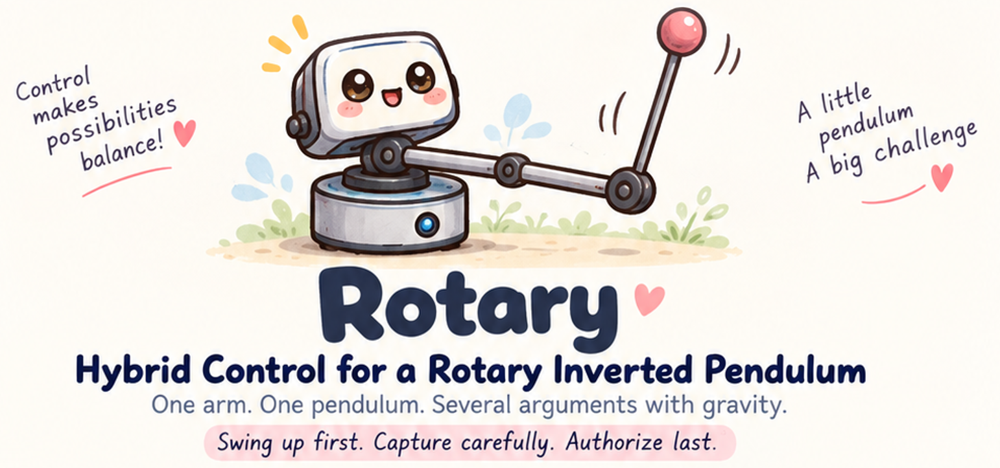

<p align="center">
  
</p>

<h1 align="center">Rotary</h1>

<p align="center">
  <strong>Rotary Inverted Pendulum Control Research</strong>
</p>

<p align="center">
  <strong>Swing hard. Capture cleanly. Respect the physics.</strong>
</p>

<p align="center">
  <em>Build momentum. Question the model. Earn the authority.</em>
</p>

<p align="center">
  🌀 Swing &nbsp;·&nbsp; 🎯 Capture &nbsp;·&nbsp; ⚖️ Balance &nbsp;·&nbsp; 🔬 Validate
</p>

Rotary is a Rust-first, `no_std` control system for a Furuta-style rotary inverted pendulum. It keeps physical evidence, estimated state, control intent, actuator limits, runtime authority, and electrical realization deliberately separate so that controller confidence never becomes permission to move by accident.

> **An unstable plant with a very stable chain of authority.** Swing up, capture, balance — but never confuse evidence, control intent, and permission to move.

This project is a ground-up re-architecture from physical I/O to hybrid control. It shares one architectural grammar with `single-wheel-platform`: **same architecture, different plant**.

## 🧭 Architecture

```text
                  CONTROL
                     ▲
                     │
                 SUPERVISOR
                  ▲      ▲
                  │      │
                PLANT    │
                  ▲      │
                  └──┬───┘
                     │
                 FIRMWARE
```

The four canonical domains define ownership and dependency, not runtime execution order:

- **Plant** — physical state, units, dynamics, measurement physics, actuator physics, and generalized physical input/output semantics.
- **Control** — desired closed-loop behavior: energy-based swing-up, capture/transition management, and upright state feedback.
- **Supervisor** — state estimation, runtime qualification, output safety, timing health, watchdogs, and physical-output authority.
- **Firmware** — sensor acquisition, electrical/protocol actuation semantics, board wiring, buses, communications, UI, recording, MCU peripherals, and target composition.

`support/`, `parameters/`, `docs/`, and `tools/` support the production architecture; they are not additional production domains.

## 🎯 Plant semantics

The canonical estimated state is:

```text
x = [theta, theta_dot, phi, phi_dot]
```

where `theta` is the wrapped pendulum angle and `phi` is the continuous / unwrapped rotary-arm angle.

Control speaks in physical generalized semantics:

```text
EstimatedState
    ↓
Controller
    ↓
GeneralizedDemand { arm_torque }
```

The controller does **not** emit PWM, direction GPIO, or H-bridge commands. `plant/actuator-model` converts physical arm-torque demand into a bounded actuator command; Firmware owns TB6612 electrical realization.

The Plant domain includes a source-backed reduced Furuta model for production analysis plus actuator models ranging from a compact static torque span to a speed-aware DC-motor model with resistance, torque constant, back-EMF, gearbox ratio/efficiency, supply authority, command deadzone, and explicit current limiting.

## 🎢 Hybrid control

The Control domain implements three regimes:

```text
Hanging / low energy
        ↓
     SwingUp
        ↓ capture window
      Capture
        ↓ settled upright window
      Balance
```

`EnergySwingUpController` implements an energy-balance law with a bounded dead-start kick. `CapturePolicy` provides separate entry/exit thresholds, settle-cycle qualification, and hysteresis. During `Capture`, swing-up and balance torque demands are blended as the pendulum approaches the upright region. `Balance` uses full-state feedback.

Operational permission is intentionally separate from control regime:

```text
RuntimeState                 ControlRegime
-----------                  -------------
Disabled                     SwingUp
Ready                        Capture
Active(ControlRegime)        Balance
Fault(reason)
```

A controller can know exactly what it wants to do and still have **zero authority to do it**.

## 🧬 Typed semantic path

The canonical production path is deliberately typed end to end:

```text
RawObservation
    ↓
EstimatorMeasurement
    ↓
EstimatedState
    ↓
GeneralizedDemand
    ↓
BoundedActuatorCommand
    ↓
AuthorizedActuation
    ↓
Firmware ActuationSink
    ↓
Tb6612ElectricalActuation
    ↓
Tb6612FrameIo
    ↓
physical output
```

These are intentionally different semantic objects. A sensor sample is not a state estimate; a torque request is not a motor command; a bounded command is not authorization; authorization is not electrical output.

The STM32F103 computation path materializes the same semantics through the authority decision:

```text
TIM1 / 1 kHz control opportunity
    ↓
Pendulum ADC + Arm Encoder + DWT timestamp
    ↓
RawObservation
    ↓
EstimatorInputAdapter
    ↓
BasicEstimator
    ↓
EstimatedState
    ↓
HybridController
    ↓
GeneralizedDemand
    ↓
ArmActuatorModel
    ↓
BoundedActuatorCommand
    ↓
Command Safety
    ↓
RuntimeAuthority
    ↓
AuthorityDecision
```

## 🛡️ Actuation authority

Physical output requires semantic promotion by Supervisor:

```text
BoundedActuatorCommand
        ↓
Command Safety
        ↓
RuntimeAuthority
        ↓
AuthorizedActuation
        ↓
Firmware ActuationSink
        ↓
actuator-specific frame
        ↓
frame I/O backend
        ↓
physical output
```

`supervisor/actuator-safety` owns output magnitude and slew qualification separately from controller logic. Simulation safety profiles are simulation configuration; they are **not** claims of Forest D1 physical-safe limits.

`AuthorizedActuation` has no public constructor. Maintenance output uses a distinct `MaintenanceActuation` proof type and a mutually exclusive Supervisor-owned maintenance authority mode.

The TB6612 path preserves the same proof boundary:

```text
AuthorizedActuation / MaintenanceActuation
        ↓
Tb6612Output
        ↓
Tb6612Mapper
        ↓
Tb6612ElectricalActuation
        ↓
Tb6612FrameIo
```

Drive frames cannot be publicly constructed. `safe_off()` remains the only unqualified output action. `Tb6612PwmDirIo` performs break-before-make by forcing PWM to zero before changing direction pins.

## 🌙 Non-actuating STM32 target

The current STM32F103 automatic-control path is deliberately non-actuating:

```text
RuntimeAuthority   = disarmed
RuntimeState       = Ready
D2 PWM duty        = 0
D2 direction pins  = low / low
runtime D2 sink    = unbound
```

PB1/TIM3_CH4 is configured for 20 kHz PWM with zero duty, while PB13/PB12 are driven low. No runtime `ActuationSink` owns the D2 motor peripherals, so control computation cannot reach the physical motor.

The target still executes the sensing, estimation, hybrid-control, actuator-model, command-safety, qualification, and authority logic needed to produce trustworthy non-actuating evidence.

> **Green simulation is evidence. It is not a motor key.**

## ⏱️ Runtime, telemetry, and UI

TIM1 provides a fixed **1 kHz control opportunity**. One observed update admits at most one fresh acquisition/control cycle; missed periods are not replayed as backlog. DWT/`MonoTimer` remains the independent monotonic timing source.

The independent watchdog (`IWDG`) uses a 100 ms timeout and is fed after each admitted opportunity is serviced.

`firmware/recording/runtime-observation` publishes the canonical live runtime snapshot. `firmware/recording/timing-evidence` records admission timing, jitter, execution time, missed/coalesced ticks, deadline overruns, Supervisor late/timeout counts, and runtime acquisition/control errors. Critical-path timing ends before UART and OLED background service.

Local services stay outside the critical control path:

```text
telemetry   USART1 / 115200 / latest-snapshot, no replay
OLED        SSD1315 128×64 / bounded background flush
SWD         retained on PA13 / PA14
```

The local UI exposes `STATUS`, `SENSOR`, `SAFETY`, `CONTROL`, and `MAINTENANCE` views without owning control authority.

## 🧪 Software-In-The-Loop

Host SITL lives under `tools/sitl/`; it is verification tooling, not a fifth production domain.

```text
Virtual Furuta Plant
        ↓
Synthetic device-like sensor evidence
        ↓
RawObservation
        ↓
production measurement adapter
        ↓
production estimator
        ↓
production hybrid controller
        ↓
production actuator model
        ↓
production output safety
        ↓
production RuntimeAuthority
        ↓
AuthorizedActuation
        ↓
virtual TB6612 / actuator
        └────────────────────→ Virtual Furuta Plant
```

Simulator truth is deliberately converted back into device-like sensor evidence before entering the production semantic path. The estimator never receives hidden simulator state as a shortcut.

A missed runtime opportunity is missed; it is not replayed later. SITL safety limits remain explicitly simulation-only.

## 🔬 Validation and evidence

The host validation stack intentionally uses models with different failure modes:

```text
source-backed reduced QNET model
        ├── Rust production model
        └── SciPy independent reference

geometry-derived full 3-D Furuta model
        ├── analytical oracle
        └── PyBullet rigid-body reviewer
```

Rust and SciPy test equation/implementation consistency. The full-3D oracle and PyBullet pressure-test omitted rigid-body physics. Agreement increases confidence; disagreement opens a model, sign, coordinate, parameter, or simulator-semantics investigation.

The reduced QNET model remains useful for local upright analysis and source-controller reproduction. Full 3-D dynamics challenge wider-angle and higher-rate assumptions. Model complexity does not grant universal authority; each model must earn a task-specific validity region.

Simulation evidence is **not** specimen calibration and never grants physical actuator authority.

## 📏 Parameters and provenance

Reference-backed nominal parameters are allowed when specimen-specific values are not part of the implemented system definition. They carry:

```text
value
unit
source
applicability
```

The STM32F103 live-shadow controller uses a QNET rotary-inverted-pendulum reference model from Abdullah et al. (2021), converted into project state order, project angle signs, and rotary-arm torque semantics.

```text
project state order: [theta, theta_dot, phi, phi_dot]
nominal torque-feedback gains used by u = -Kx:
[-0.18355, -0.01585, -0.01120, -0.00745]
```

Reference-backed nominal values support modeling and controller development; they do not silently become Forest D1 specimen facts.

```text
literature / vendor evidence
        ↓
reference-backed nominal parameters
        ↓
model / simulation
        ↓
written physical prediction
        ↓
bounded physical experiment
        ↓
specimen-specific evidence
```

Each evidence layer may earn the next layer of authority. It may not skip directly from a paper or simulator to physical actuation.

## 🧰 Repository shape

```text
plant/        physical state, dynamics, measurement and actuator semantics
control/      swing-up, capture, state feedback
supervisor/   estimation, safety, runtime state, authority
firmware/     sensors, buses, UI, telemetry, actuators, boards, targets
parameters/   parameter registry and provenance
support/      shared implementation primitives
tools/        SITL, model validation, telemetry/evidence tooling
docs/         durable architecture and hardware documentation
```

The detailed ownership map lives in [`docs/development/repository-layout.md`](docs/development/repository-layout.md).

## 🔧 Build and test

```bash
cargo test-host
cargo build-stm32f103
```

The deterministic Rotary SITL baseline can be run with:

```bash
cargo run -p rip-sitl --release -- \
  --scenario tools/sitl/scenarios/rotary_balance.toml \
  --parameters parameters/reference-assembly.json \
  --output target/sitl-balance
```

See [`docs/development/build-and-test.md`](docs/development/build-and-test.md) for the full host-test, SITL, Clippy, and target-build workflow.

## 📚 Documentation principle

> **README explains the system. Issues explain the journey. Code proves the current state.**

README and durable documentation define architecture, interfaces, safety and authority boundaries, model interpretation, reference usage, and evidence gates. GitHub Issues preserve experiments, calibration work, temporary constraints, alternatives, implementation progress, and validation history. Code, configuration, target composition, and tests remain the authoritative evidence of executable behavior.

### Key documentation

- [Control Architecture](docs/architecture/control_architecture.md)
- [Runtime Supervisor](docs/architecture/runtime_supervisor.md)
- [Repository Layout](docs/development/repository-layout.md)
- [Build and Test](docs/development/build-and-test.md)
- [Forest D1 2016 Hardware Baseline](docs/hardware/forest-d1-2016-baseline.md)
